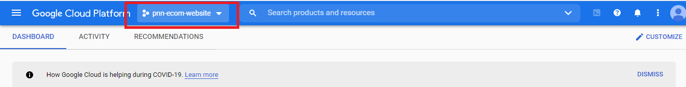
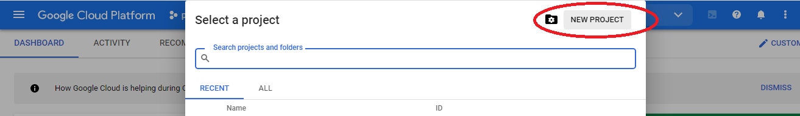
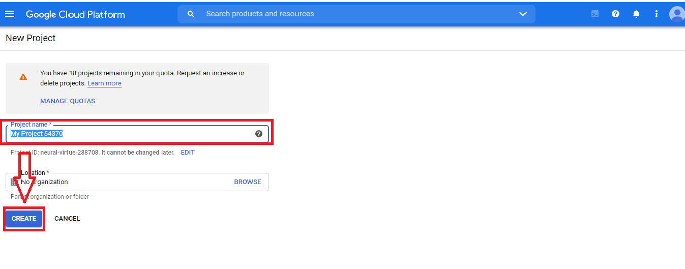
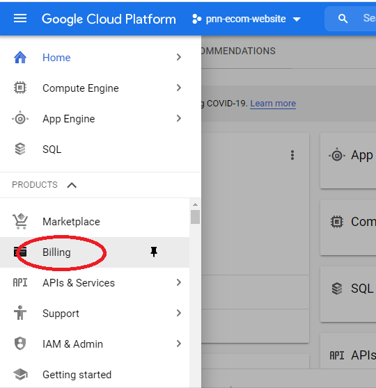

# Adding custom domain to django app in app engine
Detailed explanation about hosting a django app in App engine and add our custom domain
## Introduction:
This repository is made for easy learning purpose and especially for beginners.I will explain all the things where I strucked and what I required as a beginner while starting this project to help others who are starting with cloud.

## Requirements:
* GCP free tier
## Steps:
* Creating a project
* Enable billing for app engine
* Billing alerts
* Uploading or cloning sample django app to deploy
* Adding custom domain name
## Creating a project:
(NOTE: If you already created a project then you can skip this step and proceed with Enable billing)
* Go to [Google cloud console](https://console.cloud.google.com/projectcreate?_ga=2.124891343.471773399.1599312544-457839113.1597670267&_gac=1.123082233.1598172063.Cj0KCQjwp4j6BRCRARIsAGq4yMFryeAdJS_0RyOfVJQgKKPqPdrBK7BcBhCXfKS_EyCtog2s5d-ihrsaAnxfEALw_wcB) and login with your details.
* You will see a dropdown box to select a project or to create a project as I displayed here.

* Now click on New project to create a new project as highlighted here.

* Then Enter the project name and note down the project ID for future reference.

## Enable billing:
**App engine requires billing to be enabled but when you are in free tier money will be detected only if your free quota exceeded to be aware of this billing you can set alerts to keep in track of billing which will be discussed in billing and alerts** 
(NOTE:You should allow permission in IAM & ADMIN for creating budgets.Refer [here](https://cloud.google.com/billing/docs/how-to/budgets#create-budget))
* Click the Navigation menu *->* Billing

* Go to **Budgets and alerts** and click **create budget**

* Put name for your budget and click **next**

* Select budget type as **specified amount**(to specify our amount) or **Last month's budget**(to keep last month's amount as budget)
* In **target amount**,specify the amount when you need to be alerted and click **Next**.

* You can set at what value you should get your alert (Example:when you reach 50% of your budget you will be alerted)
* click **Finish**
## Uploading or cloning sample django app to deploy:
* You can upload your django project to the cloud shell with app.yaml file.(For app.yaml file,you can refer [this](https://cloud.google.com/appengine/docs/standard/go/config/appref)
* For testing purpose we can clone this repository to the clous shell.
#### Cloning in cloud shell:
* Open cloud shell by clicking the icon that I mentioned below.

* While you are opening, If prompted click **continue**
* Enter the command in cloud shell for cloning. 
    `git clone https://github.com/GoogleCloudPlatform/python-docs-samples.git`
* To go to the directory where django project is present.
    `cd python-docs-samples/appengine/standard_python3/hello_world`
* 
